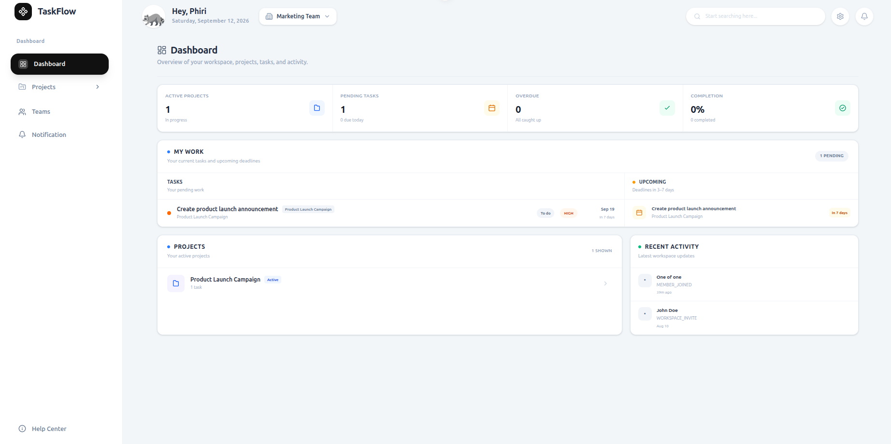
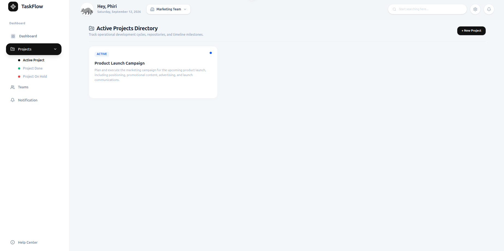
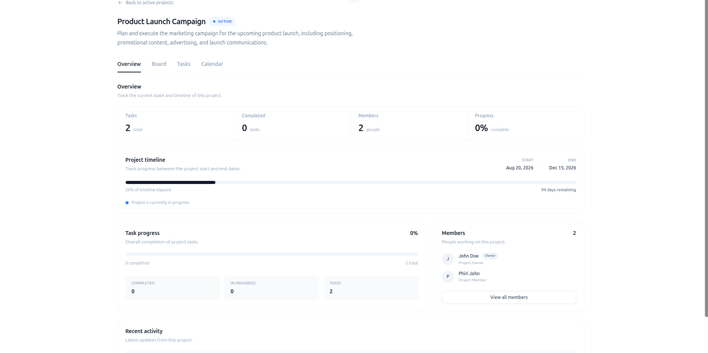
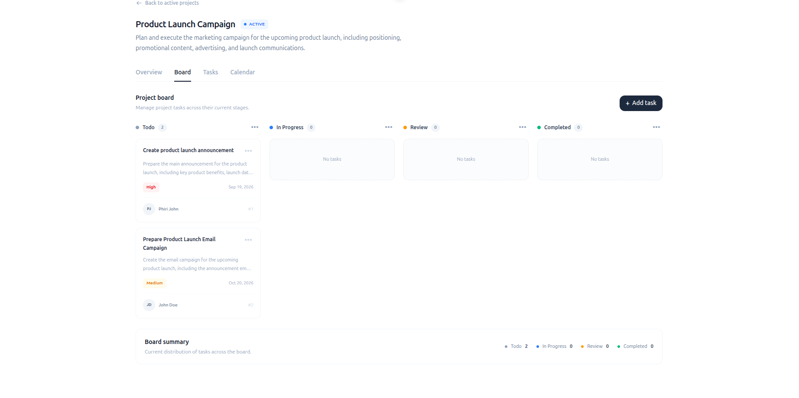
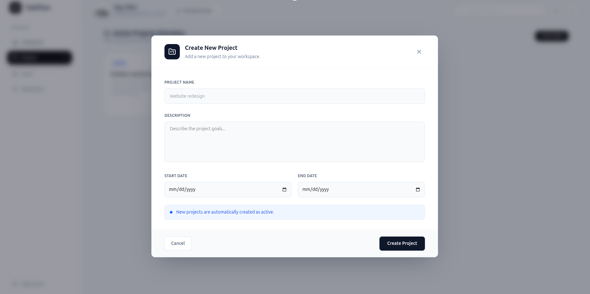

# 🚀 TaskFlow — Project Management Platform

TaskFlow is a modern full-stack project management platform designed to help teams organize projects, manage tasks, collaborate with team members, and track project progress from a centralized workspace.

The application uses a separate frontend and backend architecture, with **Vue.js** and **TypeScript** powering the frontend, **NestJS** providing the backend REST API, and **MySQL** handling persistent data storage.

---

## ✨ Features

- 📊 **Dashboard** — Overview of projects, tasks, and workspace activity.
- 📁 **Project Management** — Create, update, organize, and track projects.
- ✅ **Task Management** — Create, update, and manage project tasks.
- 📋 **Project Board** — Visualize tasks and their progress.
- 📅 **Project Calendar** — Manage project schedules and deadlines.
- 👥 **Team Management** — Manage workspace members and teams.
- 🔔 **Notifications** — Keep users informed about important activity.
- 💬 **Comments** — Collaborate and communicate within projects.
- 🔐 **Authentication** — User registration and sign-in.
- ⚙️ **Workspace Management** — Organize projects and members into workspaces.
- 📈 **Project Reports** — View project-related information and progress.
- 📱 **Responsive UI** — Designed for desktop and smaller screens.

---

## 🖥️ Screenshots

### 📊 Dashboard



### 📁 Project List



### 📋 Project Details



### 📌 Project Board



### ➕ Create Project



---

## 🏗️ Architecture

TaskFlow uses a separated frontend and backend architecture:

```text
┌──────────────────────────────┐
│       Vue.js Frontend        │
│      TypeScript + Vite       │
└──────────────┬───────────────┘
               │
               │ REST API
               ▼
┌──────────────────────────────┐
│        NestJS Backend        │
│      TypeScript + REST API   │
└──────────────┬───────────────┘
               │
               │ Database
               ▼
┌──────────────────────────────┐
│            MySQL             │
│           Database           │
└──────────────────────────────┘
````

 ### How It Works

```
User
 │
 ▼
Vue.js Frontend
 │
 │ HTTP / REST API
 ▼
NestJS Backend
 │
 │ Database Queries
 ▼
MySQL
```

 The frontend is responsible for the user interface and client-side application state.

 The NestJS backend handles:

 - API requests
- Authentication
- Authorization
- Business logic
- Data validation
- Database communication

 MySQL is used for persistent application data.

---

 ## 🔗 Related Repositories

 TaskFlow is organized into separate frontend and backend repositories.

 | Repository | Technology | Purpose |
| --- | --- | --- |
| Frontend | Vue.js + TypeScript + Vite | Web application and user interface |
| Backend | NestJS + TypeScript + MySQL | REST API, authentication, business logic, and database integration |

 ### Frontend Repository

 **TaskFlow Frontend**

 Vue.js + TypeScript + Vite

 👉 View the Frontend Repository

 ### Backend Repository

 **TaskFlow Backend**

 NestJS + TypeScript + MySQL

 👉 View the Backend Repository

---

 ## 🛠️ Technology Stack

 ### Frontend

 - Vue.js
- TypeScript
- Vite
- CSS
- REST API

 ### Backend

 - NestJS
- TypeScript
- REST API
- Authentication and authorization
- Database services

 ### Database

 - MySQL

---

 ## 📂 Project Structure

```
taskflow-project-management/
│
├── public/
│
├── images/
│   ├── board.png
│   ├── createproject.png
│   ├── dashboard.png
│   ├── projectdetails.png
│   └── projectlist.png
│
├── src/
│   ├── assets/
│   │
│   ├── components/
│   │   ├── activeProject/
│   │   ├── dashboard/
│   │   ├── dialogs/
│   │   ├── home/
│   │   └── support/
│   │
│   ├── services/
│   │   ├── stores/
│   │   └── *.service.ts
│   │
│   ├── types/
│   │
│   ├── views/
│   │
│   ├── router/
│   │
│   ├── App.vue
│   └── main.ts
│
├── README.md
├── package.json
├── package-lock.json
├── vite.config.ts
├── tsconfig.json
└── .gitignore
```

 ### Directory Overview

 | Directory | Purpose |
| --- | --- |
| `components/` | Reusable and feature-specific Vue components |
| `components/dashboard/` | Dashboard-related components and views |
| `components/activeProject/` | Project workspace and project management UI |
| `components/dialogs/` | Create, update, and detail dialogs |
| `components/home/` | Landing page components |
| `components/support/` | Help, FAQ, and support components |
| `services/` | API services and application logic |
| `services/stores/` | Application state management |
| `types/` | TypeScript types and interfaces |
| `views/` | Main application pages |
| `router/` | Vue Router configuration |
| `images/` | Project screenshots used in the README |
| `public/` | Static public assets |

---

 ## 🚀 Getting Started

 ### Prerequisites

 Make sure you have the following installed:

 - Node.js
- npm

 ### 1\. Clone the Repository

```
git clone https://github.com/Phiri19007/taskflow-project-management.git
```

 ### 2\. Navigate into the Project

```
cd taskflow-project-management
```

 ### 3\. Install Dependencies

```
npm install
```

---

 ## ▶️ Run the Development Server

 Start the frontend development server:

```
npm run dev
```

 Vite will display the local development URL in your terminal.

---

 ## 🏭 Build for Production

 Create a production build:

```
npm run build
```

 To preview the production build locally:

```
npm run preview
```

---

 ## 🔧 Backend

 The TaskFlow backend is built with NestJS and provides the REST API consumed by the Vue.js frontend.

 The backend is responsible for:

 - User authentication
- User management
- Workspace management
- Project management
- Task management
- Team members
- Notifications
- Comments
- Project reports
- MySQL database communication

 The backend is maintained in a separate GitHub repository.

 👉 Open the TaskFlow Backend Repository

---

 ## 🗄️ Database

 TaskFlow uses **MySQL** for persistent data storage.

 The database stores application data including:

 - Users
- Workspaces
- Projects
- Tasks
- Comments
- Notifications
- Workspace members

 The NestJS backend manages communication between the Vue.js frontend and MySQL database.

```
Vue.js
   │
   │ REST API
   ▼
NestJS
   │
   │ SQL / ORM
   ▼
MySQL
```

---

 ## 🔮 Future Improvements

 - 🔐 Role-based permissions
- 🔔 Real-time notifications
- 💬 Real-time team collaboration
- 📊 Advanced analytics
- 📅 Calendar improvements
- 🌙 Dark mode
- 📱 Improved mobile experience
- 🧪 Automated testing
- 🚀 Production deployment
- 📧 Email notifications
- 🔎 Advanced search and filtering

---

 ## 🎯 Project Goals

 TaskFlow was created to demonstrate the development of a modern full-stack application using a separated frontend and backend architecture.

 The project focuses on:

 - Component-based frontend development
- REST API integration
- State management
- Authentication
- Database-driven applications
- Scalable project organization
- Responsive user interfaces
- Full-stack application architecture

---

 ## 🤝 Contributing

 Contributions, suggestions, and feedback are welcome.

 ### Create a Feature Branch

```
git checkout -b feature/your-feature
```

 ### Make Your Changes

```
git add .
git commit -m "Add your feature"
```

 ### Push Your Branch

```
git push origin feature/your-feature
```

 Then open a pull request.

---

 ## 📄 License

 This project is currently available for educational and portfolio purposes.

---

 ## ⭐ Support

 If you find TaskFlow useful or interesting, consider giving the repository a star ⭐.

---

 **Built with ❤️ using Vue.js, TypeScript, NestJS, and MySQL.**

